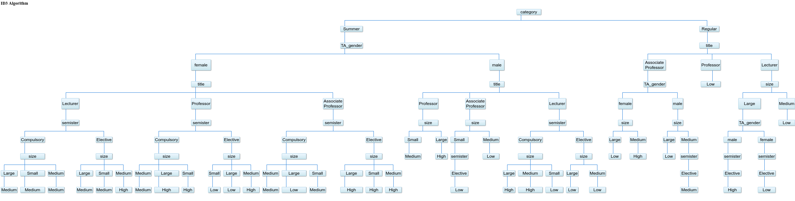

# Week 2

## 教学成绩的评估

### 数据集

数据集采用,考量各个因素对最终成绩的影响.

数据包括151个在三个常规学期和两个夏季学期的教学绩效的评估.

### 数据属性

1. 助教性别
2. 课程教师职称, 分为Professor, Associate Professor, Lecturer.
3. 课程类别, 分为Compulsory, Elective.
4. 夏季学期或常规学期.
5. 课堂人数, 分为Small, Medium, Big.
6. 成绩评估, 分为Low, Medium, High.

### 具体数据

json格式, 共包括151组数据
```json
{
  "TA_gender": "male",
  "title": "Lecturer",
  "semister": "Elective",
  "category": "Regular",
  "size": "Medium",
  "performance": "Low"
}, {
  "TA_gender": "female",
  "title": "Professor",
  "semister": "Elective",
  "category": "Regular",
  "size": "Large",
  "performance": "Low"
}, {
  "TA_gender": "male",
  "title": "Lecturer",
  "semister": "Elective",
  "category": "Summer",
  "size": "Medium",
  "performance": "Low"
}
...
```
所有数据详见[data.json](data.json)

训练出来的决策树如图：


