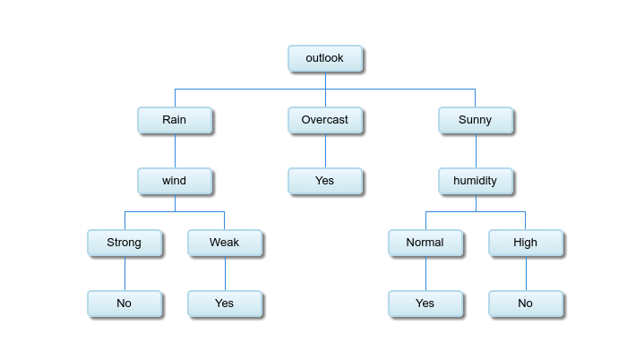

# Week 2

## 作业1：用一个具体的数据集应用id3算法获得分类规则

采用这个经典的数据集

| Day | Outlook  | Temperature | Humidity | Wind   | Play ball |
| --- | -------- | ----------- | -------- | ------ | --------- |
| D1  | Sunny    | Hot         | High     | Weak   | No        |
| D2  | Sunny    | Hot         | High     | Strong | No        |
| D3  | Overcast | Hot         | High     | Weak   | Yes       |
| D4  | Rain     | Mild        | High     | Weak   | Yes       |
| D5  | Rain     | Cool        | Normal   | Weak   | Yes       |
| D6  | Rain     | Cool        | Normal   | Strong | No        |
| D7  | Overcast | Cool        | Normal   | Strong | Yes       |
| D8  | Sunny    | Mild        | High     | Weak   | No        |
| D9  | Sunny    | Cool        | Normal   | Weak   | Yes       |
| D10 | Rain     | Mild        | Normal   | Weak   | Yes       |
| D11 | Sunny    | Mild        | Normal   | Strong | Yes       |
| D12 | Overcast | Mild        | High     | Strong | Yes       |
| D13 | Overcast | Hot         | Normal   | Weak   | Yes       |
| D14 | Rain     | Mild        | High     | Strong | No        |

### 计算过程

Entropy(D) = -9/14 \* log2(9/14) - 5/14 \* log2(5/14) = 0.940

Entropy(Outlook,D) =  5/14 \* [- 2/5 \* log2(2/5) – 3/5 \* log2(3/5)] + 4/14 \* [ - 4/4 \* log2(4/4) - 0/4 \* log2(0/4)] + 5/14 \* [ - 3/5 \* log2(3/5) – 2/5 \* log2(2/5)] = 0.694

Entropy(Temperature,D) = 4/14 \* [- 2/4 \* log2(2/4) – 2/4 \* log2(2/4)] + 6/14 \* [ - 4/6 \* log2(4/6) - 2/6 \* log2(2/6)] + 4/14 \* [ - 3/4 \* log2(3/4) – 1/4 \* log2(1/4)] = 0.911

Entropy(Humidity,D) = 7/14 \* [- 3/7 \* log2(3/7) – 4/7 \* log2(4/7)] + 7/14 \* [ - 6/7 \* log2(6/7) - 1/7 \* log2(1/7)] = 0.789

Entropy(Wind,D) = 6/14 \* [- 3/6 \* log2(3/6) – 3/6 \* log2(3/6)] + 8/14 \* [ - 6/8 \* log2(6/8) - 2/8 \* log2(2/8)] = 0.892

算出D增益值：

Gain(Outlook) = Entropy(D) - Entropy(Outlook) = 0.940 - 0.694 = 0.246

Gain(Temperature) = Entropy(D) - Entropy(Temperature) = 0.940 - 0.911 = 0.029

Gain(Humidity) = Entropy(D) - Entropy(Humidity) = 0.940 - 0.789 = 0.151

Gain(Wind) = Entropy(D) - Entropy(Wind) = 0.940 - 0.892 = 0.048

选取增益最大的Outlook

此时决策树:

```java
          Outlook
        /    |    \
    Sunny Overcast  Rain
```

再算Sunny这个分枝

S<sub>Sunny</sub> = {D1, D2, D8, D9, D11} =

| Day | Temperature | Humidity | Wind   | Play ball |
| --- | ----------- | -------- | ------ | --------- |
| D1  | Hot         | High     | Weak   | No        |
| D2  | Hot         | High     | Strong | No        |
| D8  | Mild        | High     | Weak   | No        |
| D9  | Cool        | Normal   | Weak   | Yes       |
| D11 | Mild        | Normal   | Strong | Yes       |

Entropy(S<sub>Sunny</sub>) = -2/5 \* log2(2/5) - 3/5 \* log2(3/5) = 0.97095

Entropy(Temperature,S<sub>Sunny</sub>) = 2/5 \* 0 + 2/5 \* [ - 1/2 \* log2(1/2) - 1/2 \* log2(1/2)] + 1/5 \* 0 = 0.40000

Entropy(Humidity,S<sub>Sunny</sub>) = 3/5 \* 0 + 2/5 \* 0 = 0

Entropy(Wind,S<sub>Sunny</sub>) = 3/5 \* [- 1/3 \* log2(1/3) - 2/3 \* log2(2/3)] + 2/5 \* [ - 1/2 \* log2(1/2) - 1/2 \* log2(1/2)] = 0.95098

算出S<sub>Sunny</sub>增益值：

Gain(S<sub>Sunny</sub>, Humidity) = 0.970

Gain(S<sub>Sunny</sub>, Temperature) = 0.570

Gain(S<sub>Sunny</sub>, Wind) = 0.019

选取增益最大的Humidity

此时决策树:

```java
          Outlook
        /    |    \
    Sunny Overcast  Rain
    /
  Humidity
  /      \
High    Normal
```

再算High这个分枝

S<sub>Sunny,High</sub> = {D1, D2, D8} =

| Day | Temperature | Wind   | Play ball |
| --- | ----------- | ------ | --------- |
| D1  | Hot         | Weak   | No        |
| D2  | Hot         | Strong | No        |
| D8  | Mild        | Weak   | No        |

因为所有属性值都是No，所以此时决策树:

```java
          Outlook
        /    |    \
    Sunny Overcast  Rain
    /
  Humidity
  /      \
High    Normal
 |
 No
```

下一步算Normal分枝.

如此下去，即可得到完整的决策树！

最终的结果：



### 参考

-   <https://cis.temple.edu/~ingargio/cis587/readings/id3-c45.html>
-   <http://www.cise.ufl.edu/~ddd/cap6635/Fall-97/Short-papers/2.htm>

## 作业2：教学成绩的评估

### 数据集

数据集采用,考量各个因素对最终成绩的影响.

数据包括151个在三个常规学期和两个夏季学期的教学绩效的评估.

### 数据属性

1.  助教性别
2.  课程教师职称, 分为Professor, Associate Professor, Lecturer.
3.  课程类别, 分为Compulsory, Elective.
4.  夏季学期或常规学期.
5.  课堂人数, 分为Small, Medium, Big.
6.  成绩评估, 分为Low, Medium, High.

### 具体数据

json格式, 共包括151组数据

```json
{
  "TA_gender": "male",
  "title": "Lecturer",
  "semister": "Elective",
  "category": "Regular",
  "size": "Medium",
  "performance": "Low"
}, {
  "TA_gender": "female",
  "title": "Professor",
  "semister": "Elective",
  "category": "Regular",
  "size": "Large",
  "performance": "Low"
}, {
  "TA_gender": "male",
  "title": "Lecturer",
  "semister": "Elective",
  "category": "Summer",
  "size": "Medium",
  "performance": "Low"
}
...
```

所有数据详见[data.json](data.json)

训练出来的决策树如图：


