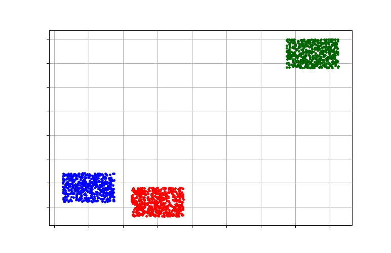

# Week 7

## 作业 自上而下或者自下而上实现一个对象集合的聚类

### Cure聚类方法

Cure方法是一种自底向上的层次聚类方法，首先将输入的每一个点作为一个聚类，然后合并相似的聚类，直到聚类的个数为k位置

### 实现

依赖于 [PyClustering](https://github.com/annoviko/pyclustering), 自己伪造十万级别的数据。伪造数据分为3个聚类中心：(20, 20), (150, 160), (60, 5)。

```python
import random
MAX_COUNT = 40000
MIN_COUNT = 30000
radius = 15

ccenter = [[20, 20], [150, 160], [60, 5]]

for i in range(0, len(ccenter)):
    count = random.randrange(MIN_COUNT, MAX_COUNT)
    for j in range(0, count):
        x = ccenter[i][0]
        y = ccenter[i][1]
        x = random.uniform(x - radius, x + radius)
        y = random.uniform(y - radius, y + radius)
        print(str(x) + ' ' + str(y))
```
执行 ```python3 fake.py > sample.txt```生成伪造数据集。

利用下面的代码进行聚类。

```python
from pyclustering.cluster import cluster_visualizer;
from pyclustering.cluster.cure import cure;

from pyclustering.utils import read_sample;

# Input data in following format [ [0.1, 0.5], [0.3, 0.1], ... ].
input_data = read_sample('sample.txt');

# Allocate three clusters:
cure_instance = cure(input_data, 3);
cure_instance.process();
clusters = cure_instance.get_clusters();

# Visualize clusters:
visualizer = cluster_visualizer();
visualizer.append_clusters(clusters, None);
visualizer.show();
```

### 结果

将聚类结果可视化如下：

