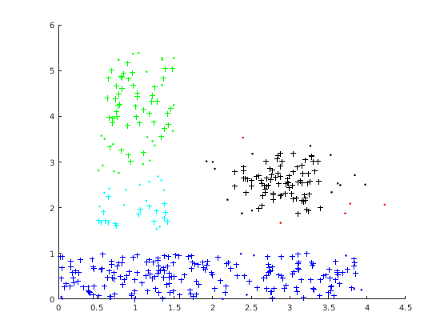

# Week 8

## 作业1 基于密度的聚类

### DBSCAN聚类方法

DBSCAN(Density-Based Spatial Clustering of Applications with Noise)算法是一种基于空间密度的聚类算法，不同于其他传统聚类，其将空间密度较高的区域聚为一簇，生成的簇没有固定形状（与之相比kmeans聚类形状为圆，em聚类形状为椭圆）,没有偏倚。DBSCAN算法除了可以实现聚类效果，也可以用于寻找数据中的噪声，这是传统聚类算法做不到的。

### 流程

算法伪代码如下，摘自维基百科：

    DBSCAN(D, eps, MinPts) {//此处eps即为半径r
       C = 0
       for each point P in dataset D {//遍历数据集
          if P is visited
             continue next point
          mark P as visited
          NeighborPts = regionQuery(P, eps)//查询p的邻域内的所有点
          if sizeof(NeighborPts) < MinPts
             mark P as NOISE//非核心点标记为噪声，注意这并非最终结果，可能在后面被归入某一类成为边界点
          else {
             C = next cluster
             expandCluster(P, NeighborPts, C, eps, MinPts)//若是核心点，则扩展该类
          }
       }
    }

    expandCluster(P, NeighborPts, C, eps, MinPts) {
       add P to cluster C
       for each point P' in NeighborPts {//遍历邻域内所有点，查询其是否可以拓展类
          if P' is not visited {
             mark P' as visited
             NeighborPts' = regionQuery(P', eps)
             if sizeof(NeighborPts') >= MinPts//若是核心点，则其邻域内的点也要继续遍历
                NeighborPts = NeighborPts joined with NeighborPts'
          }
          if P' is not yet member of any cluster//对邻域内的所有点，若尚未归类，则将其划入类C
             add P' to cluster C
       }
    }

    regionQuery(P, eps)
       return all points within P's eps-neighborhood (including P)

### 分析

1.主循环中从哪个点开始遍历并未定义，之所以强调这一点是不同的起始点可能导致不同的聚类结果。
2.当某一边界点既可以划入类簇1，也可以划入类簇2，那么其最终所处类簇与遍历时的顺序有关，这也是上面第一条的原因。
3.时间复杂度上，对每个点都要求其邻域内的所有点，复杂度为O(n2)，但在低维空间下若采用kd树、r树等数据结构则可降低至O(nlogn)。在扩展函数中需要合并两个集合，复杂度为O(mn)，m、n分别为两个集合的大小。同时注意到在扩展函数中由于对每个核心点都要进行集合合并操作，算法的绝大部分时间都将耗费在拓展函数上，算法完成时间也高度依赖于两个算法参数，尤其是 r 。

利用 [dbscan](dbscan) 的代码进行聚类。

### 结果

将聚类结果可视化如下：

## 作业2 基于网格的聚类

### STING聚类方法

STING是一种基于网格的多分辨率的聚类技术，它将输入对象的空间区域划分成矩形单元，空间可以用分层和递归方法进行划分。这种多层矩形单元对应不同的分辨率，并且形成了一个层次结构：每个高层单元被划分成低一层的单元。关于每个网格单元的属性的统计信息（如均值，最大值和最小值）被作为统计参数预先计算和存储。对于查询处理和其他数据分析任务，这些统计参数是有效的。

### 流程

STING查询算法步骤：
　　（1） 从一个层次开始
　　（2） 对于这一个层次的每个单元格，我们计算查询相关的属性值。
　　（3） 从计算的属性值以及约束条件下，我们将每一个单元格标记成相关或者不想关。(不相关的单元格不再考虑，下一个较低层的处理就只检查剩余的相关单元)
　　（4） 如果这一层是底层，那么转（6），否则转（5）
　　（5） 我们由层次结构转到下一层，依照步骤2进行
　　（6） 查询结果得到满足，转到步骤8，否则（7）
　　（7） 恢复数据到相关的单元格进一步处理以得到满意的结果，转到步骤（8）
　　（8） 停止

其核心思想就是：根据属性的相关统计信息进行划分网格，而且网格是分层次的，下一层是上一层的继续划分。在一个网格内的数据点即为一个簇。

同时，STING聚类算法有一个性质：如果粒度趋向于0（即朝向非常底层的数据），则聚类结果趋向于DBSCAN聚类结果。即使用计数count和大小信息，使用STING可以近似的识别稠密的簇。

### 结果

将聚类结果可视化如下：

